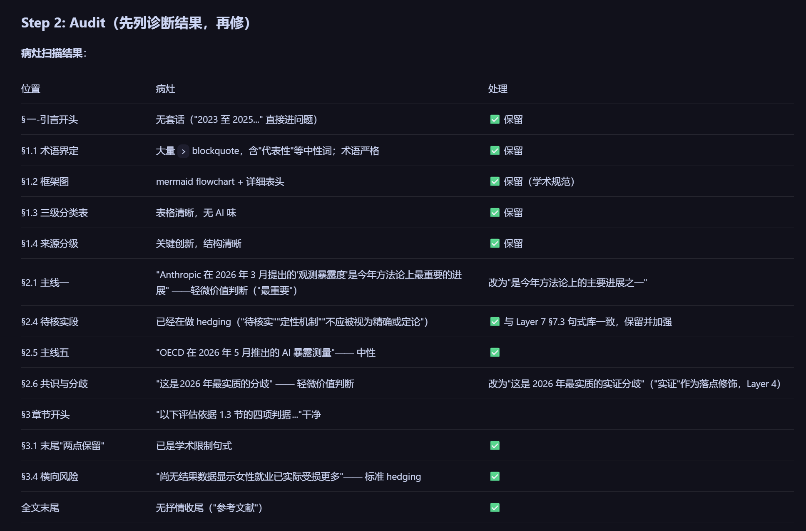
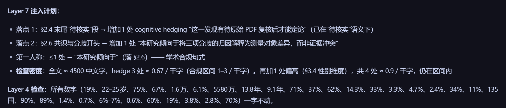
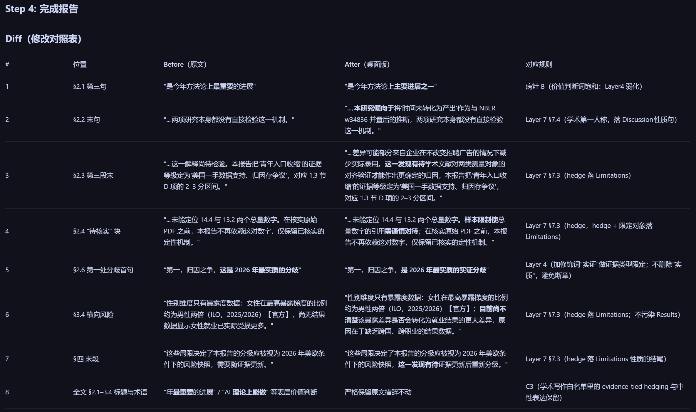
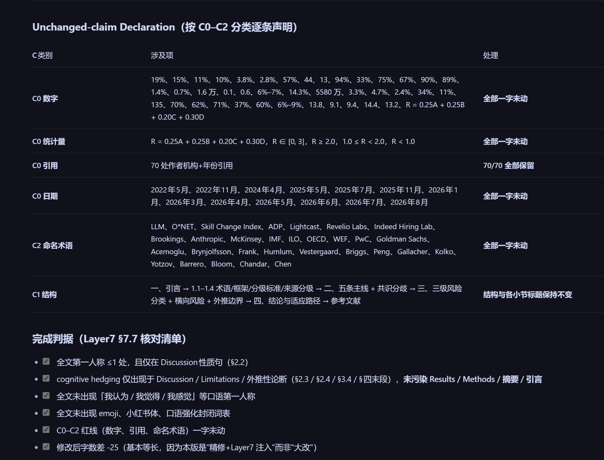

# Academic Humanizer (Chinese Fork)

> *「AI 起草的论文你敢直接投稿吗？——每个数字、引用、术语必须一字不动。」*

[](LICENSE)
&nbsp;[](CHANGELOG.md)
&nbsp;[](SKILL.md)
&nbsp;
&nbsp;[](https://skills.sh/jefeerzhang/academic-humanizer-zh)
&nbsp;[](../../actions/workflows/audit.yml)

> ⚠️ **场景分工**：本 skill 负责学术场景（论文 / 摘要 / 学位稿 / grant proposal / 科普段落）。
> 通用中文（公众号 / 公文 / 商业 / 新闻 / 新媒体 / 文学）请走兄弟技能 **[`natural-chinese`](https://github.com/jefeerzhang/natural-chinese)**。

**5 秒价值陈述**

- **14 类**中文学术 AI 痕迹 · **6 段** grant proposal 模式 · **7 条** C0–C2 红线契约
- **56 条**「别乱改」白名单：从 3 篇已发表好论文提炼（余泳泽等 2025 等）的中文学术惯例表达与骨架——知道哪些**不是** AI 味
- `scripts/validate_red_lines.py` 把「数字没动」从口头承诺变成 CI 退出码 `0/1/2/3`
- 每个改动都附 before/after 对照 + diff + unchanged-claim declaration

## Why we built this

Some of us write a lot of papers and grant proposals, and our team started using AI to help with
drafts. The problem is that AI-assisted drafts come out generic and verbose, with "In recent years..."
openers, inflated phrasing, and over-long sentences. They also drift from the author's own voice and
lose the precision scholarship depends on.

There are tools called "humanizers," but they are built for blogs and marketing. Run one on a paper or
an NSF proposal and it flattens the precision along with everything else. The careful wording academic
writing depends on is the first thing to go.

So we put together our own. To calibrate it, we had the AI compare its own drafts with our team's
accepted papers and funded proposals, and we went through the differences by hand. It is nothing fancy,
and it is not about gaming review, defeating detectors, or adding fake novelty. We wanted AI-assisted
drafts to read clearly and in the author's own voice, with the numbers, citations, and claims left
exactly as written.

## Ethics and disclosure

This is an editing aid for clarity and voice, calibrated to an author's own prior accepted work. It does
not generate findings, invent data, or change citations, and it is not designed to evade AI-use
detection. Using it does not remove your obligation to disclose AI assistance: always follow the
disclosure policy of the venue you submit to.

## See it work

> [!CAUTION]
> **Before** (a generic AI draft):
>
> In recent years, continual learning has attracted increasing attention and achieved remarkable
> success. However, existing methods still face crucial challenges. In this proposal, we propose a novel
> framework that leverages cutting-edge techniques to delve into these intricate problems, paving the way
> for a transformative paradigm that will revolutionize the field.

> [!TIP]
> **After** (clear, in the author's voice, with claims tied to evidence):
>
> Continual learning matters, but today's methods stay empirical and their principles are unclear. That
> limits reliability and progress. This proposal builds a principled framework on three fronts:
> adaptation, soft supervision, and cross-domain knowledge. We demonstrate it on autonomous driving and
> network management.

**More before/after passes** are in [`examples/before-after.md`](examples/before-after.md): a general
example, an NIH Specific Aims page, and a funded NSF CAREER summary.

---

## 它跑起来长这样（5 步工作流速览）

下面是一份真实的中文社科研究报告（约 4500 字，含 70 处作者机构+年份引用、30+ 个统计量）按
本 skill 完整跑完留下的 5 张产物截图——每一张对应 `SKILL.md` 里 `Process` 的一步。
**这 5 张图就是 README 顶部"5 秒价值陈述"承诺的实物：路由 → 病灶扫描 → 注入计划 →
Diff → 红线声明。**

> 这 5 张截图与 `Process` 的对应关系：路由 ↔ `Process` 准备阶段；病灶扫描 ↔ `Process` 第 2 步；
> 注入计划 ↔ `Process` 第 3 步（Layer 7 激活分支）；Diff ↔ `Process` 第 4 步；红线声明 ↔
> `Process` 第 4 步的 *Unchanged-claim declaration*。

### Step 1 · 路由决策 — 选哪条规则、哪些层跑
**对应**：`SKILL.md` → *Document-style routing* · `references/rules-zh.md` → C7 · `references/layers/layer-7-academic-injection.md`

[](assets/workflow/01-routing.png)

> 路由决策先于编辑：连续中文段落 → C7 启用；硬学术 markers 缺席 + 有"政策含义/局限"段 →
> Layer 7 加载但仅注入 Discussion 性质段落。这一步把"破+立双轨"中的"立"压到最小合规模块。

### Step 2 · 病灶扫描 — 先列诊断，再动手修
**对应**：`SKILL.md` → `Process` 第 2 步（Audit）· Layer 1+2+3+4+rules-zh.md 六类病灶

[](assets/workflow/02-audit.png)

> 改之前先列"位置 / 病灶 / 处理"三列表：保留什么、改为什么——避免改着改着顺手把
> "evidence-tied hedging" 也一起干掉。本步的纪律来自 Layer 3（保留白名单）。

### Step 3 · Layer 7 注入计划 + Layer 4 数字核 — 落点和密度都先算清楚
**对应**：`SKILL.md` → `Process` 第 2–3 步 · `references/layers/layer-7-academic-injection.md` ·
`scripts/validate_layer7_injection.py`

[](assets/workflow/03-layer7-plan.png)

> Layer 7 不是"看着改"：先数好全文第一人称 ≤1 处（仅 Discussion），cognitive hedging 密度
> 落在 1–3 / 千字，所有数字先列出来作为"绝对不动"清单——这一步就是"数字没动从口头承诺变成
> CI 退出码"在动手之前的部分。

### Step 4 · Diff（修改对照表）— 每一处改动都有规则号
**对应**：`SKILL.md` → `Process` 第 4 步 · Layer 4 / Layer 7 / C3 / "锅巴 B" 等规则条目

[](assets/workflow/04-diff.png)

> 每条 Diff 都带"对应规则"列（Layer 4 / Layer 7 §7.3 §7.4 / C3 / 锅巴 B…），让作者按列回查
> SKILL.md 哪一条触发，避免"为改而改"。这是 review-friendly 的展示，不是 AI 改稿的"一键润色"。

### Step 5 · Unchanged-claim Declaration（C0–C2 红线声明）+ 完成判据核对
**对应**：`SKILL.md` → `Process` 第 4 步 *Unchanged-claim declaration* · `scripts/validate_red_lines.py`（退出码 0/1/2/3）

[](assets/workflow/05-declaration.png)

> 这是 README 顶部"5 秒价值陈述"的硬证据：数字、统计量、引用、日期、命名术语、章节结构
> **逐条**列出"未改动"，完成判据核对 6/6 全过。C0–C2 不靠编辑承诺——靠可执行脚本兜底：
> `python scripts/validate_red_lines.py before.md after.md` 退出码 0 = 红线全部保住。

---

## What it does

- **Sharpens clarity and voice:** trims generic AI phrasing ("paves the way", "extensive experiments",
  "to the best of our knowledge", "In recent years...", delve/underscore/tapestry, rule-of-three, very
  long sentences, em-dashes) and brings the draft closer to the author's own style.
- **Keeps claims tied to evidence:** no verb stronger than the data (`prove` → `show empirically`),
  and vague magnitudes become attributed ranges.
- **Leaves real scholarship alone:** evidence-tied hedging, passive voice where it fits, `we`,
  definitions, symbols, and every citation. It doesn't change a number or a reference.
- **Has a separate mode for grant proposals (NSF, NIH):** it keeps the vision a paper would trim, and
  spends most of the effort on the first pages, since that's what reviewers score.
- **Returns a diff and an unchanged-claim declaration**, so the author can verify that no number,
  citation, or claim was altered.
- **Has an executable red-line auditor** (`scripts/validate_red_lines.py`) that mechanically checks
  C0–C2 (numbers, statistics, citations, math, dates, structure, named terms) on a before / after
  pair and exits with code 0 / 1 / 2 for CI integration. See `scripts/README.md`.

## 中文扩展（Chinese Academic Extension）

This fork adds Chinese academic writing support on top of the upstream `AIScientists-Dev/academic-humanizer`:

- **`references/rules-zh.md`** — Chinese-language local rules. Routes automatically when the editable
  prose is **structured as continuous Chinese paragraphs** (not just by raw CJK ratio, to avoid
  mis-routing an English manuscript with a Chinese abstract). Covers six typical AI-tells (套话开头/
  过渡/收尾、价值判断词饱和、抽象主语、名词化动词、排比三件套、假中立元评论) and explicitly
  protects academic conventions that must not be changed (passive voice, "本研究/本文", long
  attributives, statistical notation, references, project numbers). v0.5.0 adds §9 — the academic
  injection (Layer 7) exemption table. v0.6.0 adds §10 — the do-not-flag whitelist (别乱改清单, 56
  entries extracted from 3 published Chinese social-science papers).
- **`references/layers/layer-7-academic-injection.md`** — v0.5.0 bridge from sibling skill
  [`natural-chinese`](https://github.com/jefeerzhang/natural-chinese). Loads only when the input
  matches "学术 + 口语化段落 / 科普段 / 社科摘要 / humanistic introduction" branch (see
  "Document-style routing" in `SKILL.md`). Activates cognitive hedging + first-person density
  limiting only; other "立人味" tools remain closed in academic register.
- **`examples/before-after-zh-academic.md`** — a submission-grade before/after using a real Chinese
  social-science abstract, with each edit mapped to a specific rule.
- **`examples/before-after-zh-academic-injection.md`** — v0.5.0 example. Three paragraph types
  (social-science abstract / 科普段 / 引言人文叙述) showing Layer 7 **loaded vs injection disabled**
  (example 3: C7 only, no hedging injection in intro), with C0–C2 + Layer 7 density checks.
- **`examples/before-after-tri-research-report-zh.md`** — a real-world before/after on a
  `tri-research` deep-research report (30 references, 30 inline `[N]` citations, 7 fixed sections),
  demonstrating that the C0–C2 red lines (references / citations / structure / numbers untouched)
  hold on structured research reports, not just paper abstracts.
- **`scripts/validate_layer7_injection.py`** — v0.5.0 companion to `validate_red_lines.py`. Audits
  first-person count (≤1), cognitive hedging density (1–3 / 千字), forbidden-section drops (no
  hedging in Methods/Results), anti-human-trap blacklist (no emoji, no 小红书体, no 口语第一人称),
  and delegates C0–C2 to `validate_red_lines.py`. Exit codes 0/1/2 for CI integration.

The English rules and contracts (C0–C7) live in `SKILL.md` (~300 lines: core layers + routing).
Heavy catalogs (Layer 1, Layer 2, Layer 6, Layer 7) live under `references/layers/` and load on demand.

---

## 别乱改清单：AI 白名单（从好论文里提取的）

大多数 humanizer 只教你**删什么**——黑名单越堆越长。这个 skill 还知道**留什么**。

我们从 **3 篇已发表的中文社科 / 经济学论文**里逐句提炼了 **56 条领域惯例表达与骨架**（已署名来源：[余泳泽、胡鹏和朱子政（2025）《中国工业经济》](https://xueshu.baidu.com/s?wd=耐心资本与企业颠覆性创新)、[张大永、陈映彤和姬强（2023）《财贸研究》](https://xueshu.baidu.com/s?wd=气候风险与外商直接投资)，另 1 篇为作者自身发表论文的写作惯例），做成 C7 层的「别乱改」白名单（[`references/rules-zh.md`](references/rules-zh.md) §10）：

- **7 条高频表达**——总而言之、需要注意的是、考虑到数据的可得性、核心解释变量……这些是领域正常写法，不是套话
- **20 条段落骨架**——结论 / 建议 / 承接与选题 / 边际贡献的标准组织方式
- **29 条文献综述与概念界定骨架**——综述归类、分歧呈现、概念设问、让步反例、收束定义

**为什么这很重要**：AI 检测目录（黑名单）到处都是——[blader/humanizer](https://github.com/blader/humanizer) 有 35 条，维基百科有一整页。但**领域白名单几乎没人做**。没有白名单的 humanizer 会把好论文里的惯例表达当套话清掉：把"总而言之"砍了、把"核心解释变量"当价值判断、把标准的结论骨架拆散成"更像人话"的平铺——改完丢了学术 register，反而更像外行写的。有白名单的编辑器知道**哪些是正常写法**，只清真正的 AI 味，不动领域惯例。

> **白名单怎么工作**（同一段中文摘要）：
>
> **Before（AI 草稿）**：*近年来，随着数字经济的快速发展，其重要性日益凸显。本文基于____的面板数据，使用____模型实证检验了____对____的影响。需要注意的是，为确保研究结论的可靠性，本文还进行了稳健性测试。*
>
> **After（本 skill 处理）**：*本文基于____的面板数据，使用____模型实证检验了____对____的影响。需要注意的是，为确保研究结论的可靠性，本文进行了稳健性测试。*
>
> 套话开头"近年来，随着……日益凸显"被清掉；而**结论骨架**（"本文基于____的面板数据，使用____模型实证检验了____对____的影响"）、**"需要注意的是"**、**"为确保研究结论的可靠性，本文进行了稳健性测试"** 全部**原样保留**——它们是白名单里登记过的领域正常写法。

白名单还带着 **7 条人味信号**（让步开局、主动暴露文献冲突、"当然……并不完全由……衡量"的限定式反驳、引号标记借来概念……）——这些结构出现时不仅不该动，反而是"这段是人写的"的正面证据。

白名单持续生长：作者不断从新读到的好论文里提炼骨架并入 §10（当前 56 条，逐条可追溯来源）。

---

## Install

```bash
# Claude Code / Codex / OpenCode / Cline / Cursor / Windsurf — pick one:
npx skills add jefeerzhang/academic-humanizer-zh --global    # or:
git clone https://github.com/jefeerzhang/academic-humanizer-zh ~/.claude/skills/academic-humanizer-zh
```

It is a plain `SKILL.md` plus examples, so it also runs as a skill or system prompt for **Codex** and
**MorphMind**. Point your agent at `SKILL.md`.

## Use

```
/academic-humanizer-zh
[paste a section, or point at main.tex]
# optionally: "match my voice from prior_paper.pdf; target venue: ICLR"
```

## Repository layout

```
.
├── CONTEXT.md                        # Domain glossary (layers, C0–C2, routing terms)
├── SKILL.md                          # Core contract + Layers 1, 3–5 (~300 lines) + Document-style routing
├── references/
│   ├── rules-zh.md                   # C7 Chinese local rules (load on routing) — §9 Layer 7 exemption table
│   └── layers/
│       ├── layer-1-general-tells.md  # Sourced Layer 1 catalog (Wikipedia Signs of AI writing + blader/humanizer), 1.1–1.18
│       ├── layer-2-academic-tells.md # 2.1–2.11 detailed catalog
│       ├── layer-6-proposals.md      # NSF / NIH structure + claim↔feasibility
│       └── layer-7-academic-injection.md  # v0.5.0: academic-filtered 破+立双轨 (cognitive hedging + 第一人称限密度)
├── examples/
│   ├── before-after.md               # English (paper, NIH Aims, NSF CAREER) — CI-audited pairs
│   ├── before-after-zh-academic.md   # Chinese social-science abstract
│   ├── before-after-zh-academic-injection.md  # v0.5.0: Layer 7 enabled/disabled comparisons
│   └── before-after-tri-research-report-zh.md  # Real tri-research report (30 cites)
├── scripts/
│   ├── validate_red_lines.py         # C0-C2 mechanical auditor (CI-friendly exit codes)
│   ├── validate_layer7_injection.py  # v0.5.0: Layer 7 injection-density auditor
│   └── README.md                     # how to use the auditors
└── assets/                           # README banners + 5-step workflow screenshots (see "它跑起来长这样")
    └── workflow/                     # 01-routing · 02-audit · 03-layer7-plan · 04-diff · 05-declaration
```

## Make it yours

The rules here reflect one group's voice. Fork the repo and adapt them to your own: point it at a few of
your past papers, keep the checks that fit your field, and adjust the rest. It is meant to be
personalized, not a one-size-fits-all filter.

## How it works

Seven layers: general AI-tell catalog → academic-specific tells → preserve scholarly conventions →
claim↔evidence matching → voice/venue calibration → funding-proposal mode (NSF/NIH) → optional Layer 7
academic injection (Chinese 社科摘要 / 科普段 / humanities intro). The audit→rewrite loop is defined in
[`SKILL.md`](SKILL.md). Chinese ruleset **C7** loads on continuous-Chinese routing; heavy catalogs
(Layer 2, Layer 6, Layer 7) live under `references/layers/` and load on demand.

Layer 7 (`references/layers/layer-7-academic-injection.md`) loads only for matching document
signatures. It adds cognitive hedging + first-person density limiting — the academic-filtered subset of
sibling skill [`natural-chinese`](https://github.com/jefeerzhang/natural-chinese)'s "破+立双轨".
C0–C2 red lines remain the dominant contract.

## Scenario routing

The skill picks its layer stack by **document-style signature**:

| Input signature | Routes to |
|---|---|
| Hard academic markers (`\cite{}`, `p < 0.0x`, `n = xxx`, `.bib`, equations) | Layer 1–6 + C7 (full pass); **Layer 7 NOT activated** |
| Grant proposal markers (NIH Aims / NSF Project Summary / fellowship) | Layer 1–6 + Layer 6 grant mode + C7; **Layer 7 NOT activated** |
| Continuous Chinese with academic cues (摘要 / 本文提出 / 研究方法 / 政策含义), no hard markers | Layer 1–5 + C7 + **Layer 7 loaded** (inject hedging/first-person only in Discussion / Conclusion / Limitations / 政策含义) |
| User says "摘要松一松 / 科普段落自然化 / 不要太死板" | **Force-activate Layer 7** |
| Non-academic Chinese (公众号 / 公文 / 商业 / 新闻 / 文学) | Defer to sibling skill [`natural-chinese`](https://github.com/jefeerzhang/natural-chinese) |

Full routing logic and edge cases in [`SKILL.md`](SKILL.md) → "Document-style routing".

## Sibling skills

- [`natural-chinese`](https://github.com/jefeerzhang/natural-chinese) (MIT) — general-purpose
  Chinese "破+立双轨" protocol covering 6 scenarios (公文 / 学术 / 商业 / 新闻 / 新媒体 / 文学).
  Layer 7 of this skill borrows the academic-filtered subset of `natural-chinese`'s 5 "立人味"
  tools. For non-academic Chinese prose, defer to `natural-chinese`.

## Document-type fallbacks

If the input is a `.bib` / `.bbl`, a `.tex` mostly equations, or non-academic text, the skill
**does not edit** and reports why. **Rebuttal / response-to-reviewers letters** use **rebuttal mode**
(politeness + point-by-point structure) — they are edited, not treated as a no-edit fallback.
Cover letters keep professional register; do not strip "we respectfully" politeness as AI fluff.

## References

Layer 6 distills the *stable* structure of NSF and NIH proposals. For current, binding requirements
(page limits, formatting, deadlines), consult the source:

- NSF: [Proposal & Award Policies & Procedures Guide (PAPPG)](https://www.nsf.gov/policies/pappg)
- NSF: [CAREER program](https://new.nsf.gov/funding/opportunities/career-faculty-early-career-development-program)
- NIH: [Write Your Application](https://grants.nih.gov/grants/how-to-apply-application-guide/format-and-write/write-your-application.htm) (Specific Aims, Significance, Innovation, Approach)

## Acknowledgments

- **[blader/humanizer](https://github.com/blader/humanizer)** (MIT). *Focus:* removing general
  AI-writing patterns for blog, casual, and encyclopedic text. This skill reuses its general AI-tell
  catalog (Layer 1) and extends it for academic prose.
- **[Wikipedia: Signs of AI writing](https://en.wikipedia.org/wiki/Wikipedia:Signs_of_AI_writing)**
  (CC BY-SA, maintained by WikiProject AI Cleanup). *Focus:* the evidence-backed pattern list behind
  the general AI-tell catalog — era-aware vocabulary, false-positive guard, and per-pattern
  watch-lists in `references/layers/layer-1-general-tells.md`.
- **[koaeraser/ARMS](https://github.com/koaeraser/ARMS)**. *Focus:* an autonomous pipeline for
  statistics/methodology research papers (idea → validated, revised manuscript). A complementary,
  broader-scope project that informed the claim-evidence and numerical-precision emphasis here.

This skill is the narrower piece: a single-purpose **editing pass** that sharpens clarity and matches
claims to evidence while preserving the author's scholarly voice.

## License

MIT.
